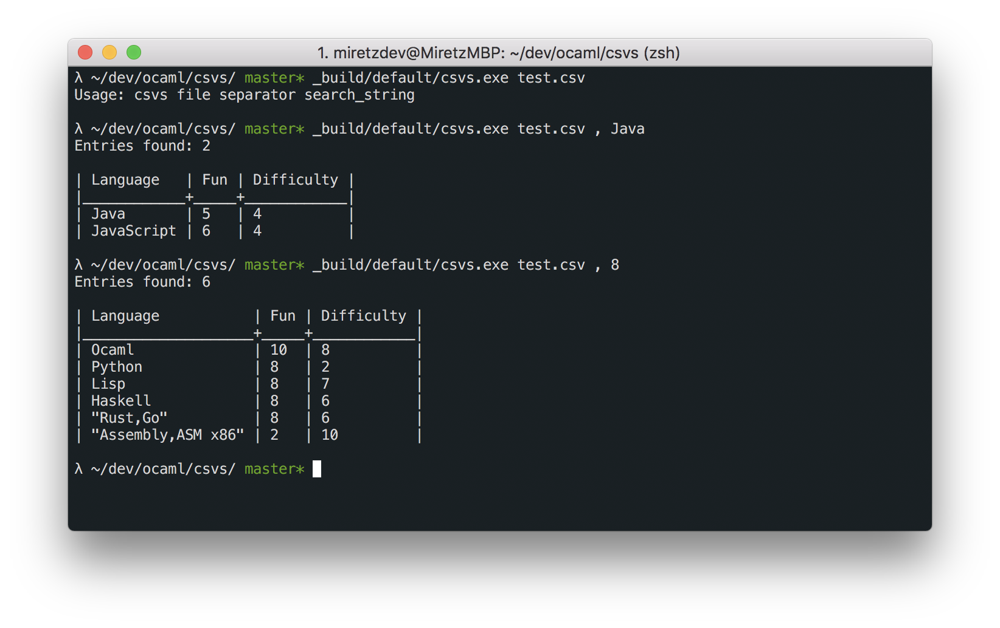

# csvs

Command Line tool written in OCaml for displaying and searching in CSV files.



## Build:

### How to setup dev environment:
https://dev.realworldocaml.org/install.html

### Install required dependencies:
```bash
opam install base utop stdio pcre
eval $(opam env)
```

### Build executable using Dune:
```bash
dune build csvs.exe
```

## Usage:
```bash
./csvs.exe file separator [search_string]
```
